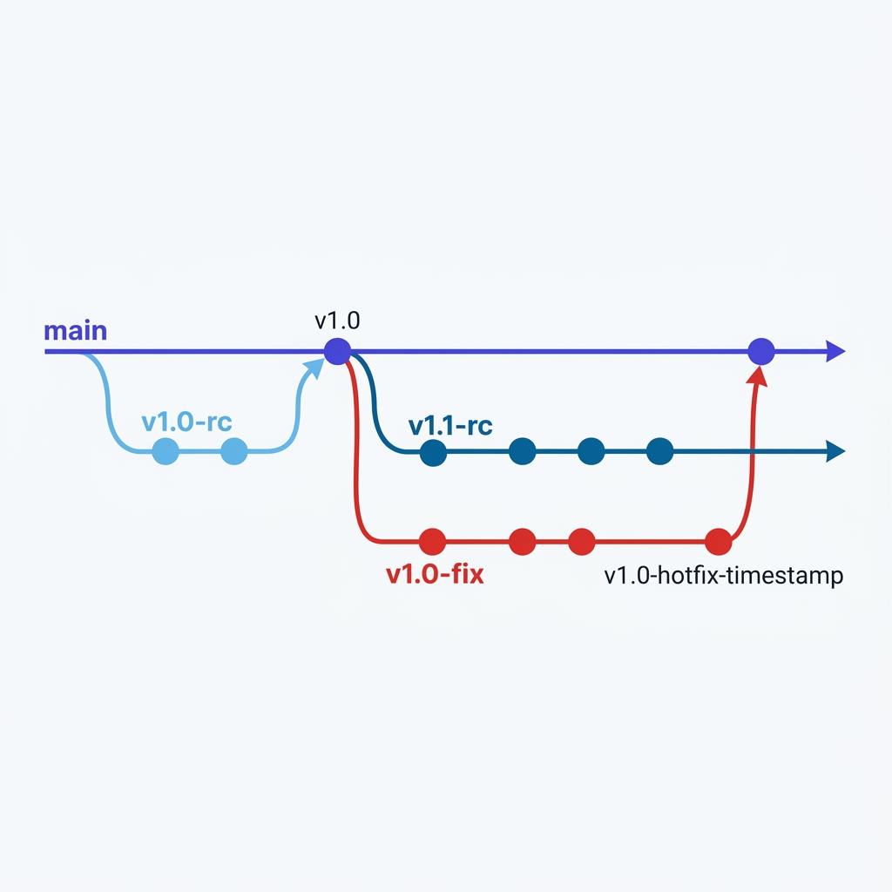

# Development & Release Flow

This document details the branch management, commit verification, and release pipeline. We follow an automated release candidate (RC) structure integrated with GitHub Actions.



---

## 1. Local Development Cycle

All development work, including fixes and new features, occurs within release candidate branches (e.g. `v1.0-rc`).

### Verification & Commit
Before pushing code, always verify the source code format:

```bash
# Run code check and linting (ignoring frontend folder)
flake8 . --exclude=web --count --exit-zero --max-complexity=20 --max-line-length=256 --statistics

# Commit changes and push to current release candidate branch
git add .
git commit -m "fix: jwt validation logic"
git push
```

---

## 2. Release & Production Deploy

When development for the version is complete, the branch is merged into `main` to trigger the release automation.

### Merging & Automatic Pipeline
1. Open a **Pull Request** on GitHub:
   * **Source Branch:** `v1.0-rc`
   * **Target Branch:** `main`
2. Once approved, **Merge** the Pull Request.
3. The merge automatically triggers the **Release Tag** workflow, which performs:
   * **Tag Creation:** Strips the `-rc` suffix from the branch name and creates the official tag (e.g., `v1.0`).
   * **Release Notes:** Automatically builds a GitHub Release with a changelog generated from the merged commits.
   * **Branch Cleanup:** Deletes the remote `v1.0-rc` branch.
   * **Docker Build:** Builds and pushes the Docker image to Docker Hub tagged with the release version.

---

## 3. Transitioning to the Next Release

Once the release is deployed, synchronize your local environment and prepare the workspace for the next cycle.

### 1. Synchronize local `main`
```bash
git checkout main
git pull
```

### 2. Create the next candidate branch (e.g., `v1.1-rc`)
```bash
# Ensure local references are clean
git fetch --prune

# Create new RC branch
git checkout -b v1.1-rc
```

### 3. Bump version and publish branch setup
Update the `"version"` field in `web/package.json` to match the new version:

```json
{
  "name": "ipxa",
  "version": "v1.1",
  ...
}
```

Commit the change and push to establish tracking:

```bash
git add web/package.json
git commit -m "docs: bump version to 1.1-rc"
git push -u origin v1.1-rc
```

## 4. Hotfix Cycle

If a critical fix needs to be deployed directly to production outside the normal development cycle, use a hotfix branch.

### 1. Create the hotfix branch
Hotfix branches must end with `-fix` (e.g., `v1.0-fix`) to match the workflow branch rules and trigger the CI/CD pipeline.

```bash
# Ensure you are on main and up to date
git checkout main
git pull

# Create the hotfix branch (must end with -fix)
git checkout -b v1.0-fix
```

### 2. Apply and push changes
Apply the fix, commit, and push the branch:

```bash
git add .
git commit -m "fix: critical security bug"
git push -u origin v1.0-fix
```

### 3. Merge and Deploy
Open a **Pull Request** from `v1.0-fix` to `main`. Once approved and merged:
* The **Release Tag** workflow automatically detects the hotfix and tags it with a timestamped version (e.g., `v1.0-hotfix-YYYYMMDDHHMMSS`).
* The remote `v1.0-fix` branch is automatically deleted.
* Docker images for both the app and portal are built and pushed with the hotfix tag.