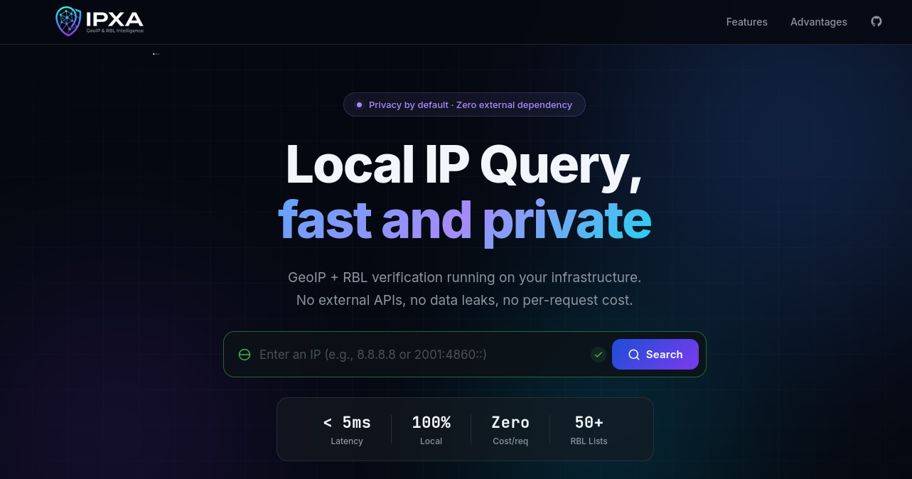

# 🛡️ IPXA
> **IP Reputation and Network Intelligence Monitoring**

**IPXA** is a high-performance, private-by-design platform for threat intelligence aggregation. It provides instant IP reputation queries, GeoIP data, and integration with 50+ Real-time Blackhole Lists (RBLs), all running entirely on your own infrastructure.

[](https://hub.docker.com/r/liberatti/ipxa)
[](LICENSE)

---

## ⚡ Performance & Privacy

- 🚀 **Ultra-low Latency**: Sub-5ms response times.
- 🔒 **100% Private**: Runs entirely on your infrastructure with optional, anonymous telemetry.
- 💰 **Zero Cost**: No per-request fees or subscription limits.
- 🔌 **Air-gap Ready**: Optimized for restricted and high-security environments.

---

## 📸 Interface


*Instantly visualize the origin and risk score of any IP address with our premium web dashboard.*

---

## 🚀 Key Features

*   🌍 **Intelligent GeoIP**: Local integration with MaxMind and ip2asn for lightning-fast lookups.
*   🚫 **RBL Consolidation**: Automated crawlers for 50+ threat feed sources.
*   ⚡ **Multiple API Flavors**: Specialized endpoints for exhaustive data, security checks, or high-speed header-based responses.
*   🎨 **Modern Dashboard**: Intuitive interface built for rapid analysis and manual IP investigation.

---

## 🛠️ Quick Deploy

IPXA is distributed as a lightweight Docker image.

### Docker Compose

```yaml
services:
  ipxa:
    image: liberatti/ipxa:latest
    container_name: ipxa
    environment:
      # - IBLOCKLIST_USERNAME=
      # - IBLOCKLIST_PASSWORD=
      # - MAXMIND_ACCOUNT_ID=
      # - MAXMIND_LICENSE_KEY=
      - IGNORE_IP_CIDRS=127.0.0.1,192.168.0.0/16,::1
    volumes:
      - ipxa_data:/data
    ports:
      - "5000:5000"
    restart: always
    deploy:
      resources:
        limits:
          memory: 256M

volumes:
  ipxa_data:
```

The `IGNORE_IP_CIDRS` variable is a comma separated list of IP CIDRs that should be ignored by IPXA hooks. 
In case the ip is in this list, the risk score will be 0 and country code will be `--`.

---

## 🔗 Server Integrations (Hooks)

IPXA provides native, high-performance middleware hooks for popular web servers, allowing you to block malicious traffic at the edge before it reaches your application.

### Apache (`mod_lua`)

Integrate IPXA directly into your Apache configuration using `mod_lua` to evaluate IPs on the fly.

**Quick Setup:**
1. Install `mod_lua` and `lua-socket` (e.g., `yum install httpd mod_lua lua-socket`).
2. Copy `hooks/httpd/lua/*.lua` to your Apache lua directory (e.g., `/etc/httpd/lua/`).
3. Update `/etc/httpd/lua/config.lua` with your IPXA API URL and settings.
4. Hook into your `VirtualHost`:
   ```apacheconf
   <VirtualHost *:80>
       ServerName example.com
       DocumentRoot /var/www/html
       LuaHookAccessChecker /etc/httpd/lua/ipxa.lua ip_info_check
   </VirtualHost>
   ```

*(See `hooks/httpd/README.md` for full details).*

### OpenResty / Nginx

Leverage the power of Lua in Nginx via OpenResty for ultra-low latency IP checking, complete with local caching.

**Quick Setup:**
1. Install the `lua-resty-http` package (via `luarocks`).
2. Copy the contents of `hooks/openresty/lua/` to your OpenResty `lualib` path (e.g., `/usr/local/openresty/lualib/ipxa/`).
3. Update `config.lua` with your IPXA API URL and blocklist settings.
4. Configure your `nginx.conf`:
   ```nginx
   http {
       # ...
       lua_package_path "/usr/local/openresty/lualib/ipxa/?.lua;;";
       lua_shared_dict ip_cache 10m; # Required for caching

       server {
           # ...
           location / {
               access_by_lua_file /usr/local/openresty/lualib/ipxa/ip_info_check.lua;
               # ...
           }
       }
   }
   ```

*(Check `hooks/openresty/nginx.conf` and `hooks/openresty/Dockerfile` for working examples).*

---

## 📡 API Reference

### 1. Full IP Info
`GET /api/ip/info/{address}`
Returns comprehensive GeoIP, ASN, and reputation data.

**Example Response:**
```json
{
  "ip": {
    "address": "14.152.94.1",
    "broadcast": "14.152.95.255",
    "network": "14.152.80.0",
    "prefix": 20,
    "version": 4
  },
  "location": {
    "continent": "Asia",
    "country_code": "CN",
    "country_name": "China"
  },
  "organization": {
    "asn_description": "",
    "asn_name": "CT-DONGGUAN-IDC CHINANET Guangdong province network",
    "asn_number": 134763
  },
  "security": {
    "reasons": [
      "rbl:firehol_level1"
    ],
    "risk_score": 0
  }
}
```

### 2. Security Check
`GET /api/ip/check/{address}`
Simplified response focused on reputation and risk assessment.

**Example Response:**
```json
{
  "ip": "14.152.94.1",
  "risk_score": 0,
  "reasons": ["rbl:firehol_level1"]
}
```

### 3. Quick Decision (Headless)
`GET /api/ip/quick/{address}`
Optimized for firewalls and middleware. Returns risk score in body and `x-risk-score` header.

**Example Response:**
```json
{
  "risk_score": 9
}
```

---

## 🛠️ Testing & Development

IPXA includes an `api.rest` file for rapid API testing.

1.  **VS Code**: Install the [REST Client](https://marketplace.visualstudio.com/items?itemName=humao.rest-client) extension.
2.  **Run**: Open `api.rest` and click `Send Request` above any endpoint.
3.  **Explore**: Use these examples as a baseline for your own integrations.

---

## 🔌 RBL Feed Configuration

The architectural design allows for dynamic addition of new feeds by adding JSON files in `config/`.

| Field | Description |
| :--- | :--- |
| `name` | Human-friendly identifier for the feed |
| `source` | Public URL for download (CIDR or IP list) |
| `format` | `cdir_text` (plain text) or `cdir_gz` (compressed) |

---

## 📦 Integrated Feeds

Includes a pre-configured library of industry-standard feeds:

- **FireHOL Level 1-4**: Highly curated aggregation.
- **Cisco Talos & DShield**: Global threat intelligence.
- **Abuse.ch Feodo**: Botnet C2 tracking.
- **Spamhaus DROP**: SBL Advisory blocks.
- **Emerging Threats**: Known compromised hosts.
- **Blocklist.de & GreenSnow**: SSH/Mail brute force.

---

## 📊 Telemetry

To help improve IPXA, the application collects anonymous usage data. This information is used to track version adoption and platform growth.

**What is collected:**
*   **Instance ID**: A randomly generated unique identifier for your installation.
*   **Version**: The current version of IPXA you are running.
*   **Source IP**: The public IP of the instance (used for geographic distribution analysis).
*   **Hits**: The total number of IP lookups processed.

**How to opt-out:**
Telemetry is enabled by default. You can disable it at any time by setting the following environment variable in your `docker-compose.yml`:

```yaml
environment:
  - TELEMETRY_ENABLE=false
```

---

## 📄 License

This project is licensed under the Apache License 2.0. See the [LICENSE](LICENSE) file for details.