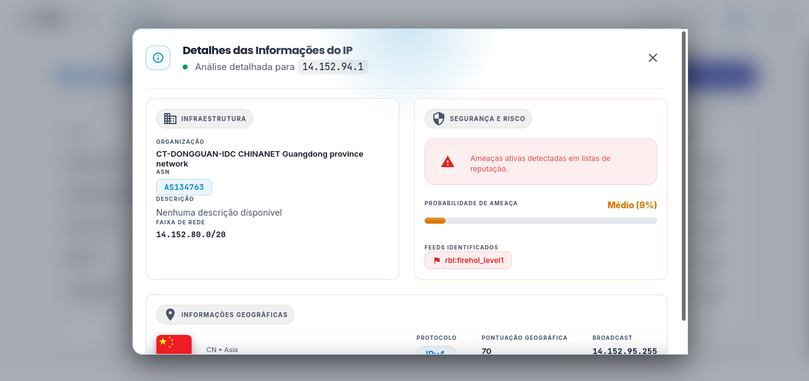

#  IPXA

> **High-Performance Threat Intelligence, GeoIP & RBL Orchestration Platform**

**IPXA** is a private-by-design platform for threat intelligence aggregation. It provides instant IP reputation queries, GeoIP lookups, and integration with 20+ Real-time Blackhole Lists (RBLs) & threat feeds, running entirely on your own infrastructure with zero cloud dependencies and sub-5ms response times.

[](LICENSE)
[](https://hub.docker.com/r/liberatti/ipxa)
[](https://liberatti.github.io/ipxa/)
[](https://github.com/sponsors/liberatti)


*Manage threat feeds, reputation scores, CIDRs, and allowlists through the administrative dashboard.*


*Detailed inspection covering GeoIP, ASN, threat scoring, and matched RBL reasons.*

---

## ⚡ Key Highlights

- 🚀 **Ultra-low Latency**: Sub-5ms local reputation and GeoIP lookups.
- 🔒 **100% Private & On-Premise**: No queries, metadata, or IP addresses ever leave your network. Air-gap friendly.
- 💰 **Zero Cost & No Rate Limits**: Self-hosted alternative to expensive SaaS IP intelligence APIs.
- 🛡️ **RBL Threat Orchestration**: Dynamic ingestion of 20+ curated threat and intelligence feeds (FireHOL 1, Cisco Talos, Abuse.ch Feodo & SSLBL, Spamhaus DROP, Emerging Threats, Blocklist.de, GreenSnow, Binary Defense, SANS DShield, Tor Exit Nodes, Cymru Bogons).
- 🔌 **Edge Server Integrations**: Native Lua middleware hooks for Apache (`mod_lua`) and OpenResty / Nginx.
- 🌓 **Modern Material UI**: High-contrast Dark and Light modes with Angular Material M3 tokens.
- 🌐 **Multi-Language (i18n)**: Full runtime internationalization supporting English (`en_US`) and Portuguese (`pt_BR`).

---

## 🎨 Admin Management Dashboard

The **Admin Dashboard** (accessible at `/ipxa/admin`) provides a high-contrast web interface for:
- Live threat feed orchestration (remote URL sync or manual CIDR embedding).
- Interactive IP intelligence lookup with GeoIP, ASN, risk evaluation, and matched feeds.
- Full session security with JWT authentication.

### Default Access Credentials

| Variable | Description | Default Value |
| :--- | :--- | :--- |
| `ADMIN_EMAIL` | Administrator login email | `admin@local` |
| `ADMIN_PASSWORD` | Administrator login password | `admin` |
| `API_KEY` | Default API key for service calls | `dev` |

---

## 🛠️ Quick Deploy

### Docker Compose

```yaml
volumes:
  data:

services:
  ipxa:
    image: liberatti/ipxa:latest
    container_name: ipxa
    environment:
      - API_KEY=dev
      # - SECURITY_ENABLED=false
      # - IPINFO_TOKEN=
      # - IBLOCKLIST_USERNAME=
      # - IBLOCKLIST_PASSWORD=
      # - MAXMIND_ACCOUNT_ID=
      # - MAXMIND_LICENSE_KEY=
    volumes:
      - data:/data
    ports:
      - "5001:5000"
    deploy:
      resources:
        limits:
          memory: 256M
    restart: unless-stopped
```

Run the container:
```bash
docker compose up -d
```
Access the Dashboard at: **`http://localhost:5001/ipxa/admin`**

---

## 🔗 Server Integrations (Edge Hooks)

IPXA provides native middleware hooks to enforce threat blocking at the web server edge before traffic hits backend application workers. Blocked requests return standardized JSON error payloads with unique `request_id` tracking for security auditing.

### Apache (`mod_lua`)

Evaluate incoming client IPs in Apache using `mod_lua`:

```apacheconf
<VirtualHost *:80>
    ServerName example.com
    DocumentRoot /var/www/html

    # IPXA Access Control Hook
    LuaHookAccessChecker /etc/httpd/lua/ipxa.lua ip_info_check

    # IPXA JSON Error Handler
    Alias /errors /etc/httpd/lua/errors.lua
    <Location /errors>
        SetHandler lua-script
    </Location>
    ErrorDocument 403 /errors
</VirtualHost>
```

*(See [hooks/httpd/](hooks/httpd/) for configuration and Dockerfile).*

### OpenResty / Nginx

Ultra-low latency edge inspection with shared in-memory dictionary caching:

```nginx
http {
    lua_package_path "/usr/local/openresty/lualib/ipxa/?.lua;;";
    lua_shared_dict ip_cache 10m; # In-memory caching

    server {
        listen 80;
        error_page 403 /lua-error;

        location / {
            access_by_lua_file /usr/local/openresty/lualib/ipxa/ip_info_check.lua;
        }

        location = /lua-error {
            internal;
            content_by_lua_file /usr/local/openresty/lualib/ipxa/errors.lua;
        }
    }
}
```

*(See [hooks/openresty/nginx.conf](hooks/openresty/nginx.conf) and [hooks/openresty/Dockerfile](hooks/openresty/Dockerfile) for working examples).*

### Standardized JSON Error Response

```json
{
  "error": "Forbidden",
  "status": 403,
  "request_id": "b10ed3a6f76ad62a75a956ce3e922336",
  "message": "ipxa [block/risk-score]: 172.20.0.1 risk_score=14"
}
```

---

## 📡 REST API Reference

### 1. Full IP Info
`GET /ipxa/api/ip/info/{address}`  
Header: `x-api-key: dev`

Returns complete GeoIP, ASN information, risk score, and matched RBL reasons.

```json
{
  "ip": {
    "address": "14.152.94.1",
    "network": "14.152.80.0",
    "prefix": 20,
    "version": 4
  },
  "location": {
    "continent": "Asia",
    "country_code": "CN",
    "country_name": "China"
  },
  "organization": {
    "asn_name": "CT-DONGGUAN-IDC CHINANET Guangdong province network",
    "asn_number": 134763
  },
  "security": {
    "reasons": [
      "rbl:firehol_level1"
    ],
    "risk_score": 9,
    "trusted": false
  }
}
```

### 2. Security Check
`GET /ipxa/api/ip/check/{address}`

Simplified response focused on threat reputation and trigger list.

```json
{
  "ip": "14.152.94.1",
  "risk_score": 9,
  "reasons": [
    "rbl:firehol_level1"
  ]
}
```

### 3. Quick Decision (Headless)
`GET /ipxa/api/ip/quick/{address}`

Optimized for firewalls and proxies. Returns risk score in JSON and response headers:
- `x-risk-score: 9`
- `x-country-code: CN`
- `x-trusted: False`

```json
{
  "risk_score": 9
}
```

---

## 🔌 RBL Feed Management

Feeds can be configured via JSON files in `config/` or dynamically edited in the Admin Dashboard:

| Field | Description |
| :--- | :--- |
| `name` | Human-friendly identifier for the feed |
| `slug` | Unique internal identifier |
| `type` | `reputation` (threat scoring) or `bypass` (allowlisting) |
| `format` | `cdir_text` (plain text URL), `cdir_gz` (compressed URL), or `embedded` (manual CIDR list) |
| `source` | Public download URL (when format is remote) |
| `data` | Array of CIDRs / IPs (when format is `embedded`) |
| `risk_score` | Weighted score contribution (0-10) |
| `update_interval` | Automatic synchronization interval (`hourly`, `daily`) |

---

## 📦 Integrated Threat Feeds

- **FireHOL Level 1**: Curated threat and attack aggregation lists.
- **Cisco Talos & DShield**: Global IP blacklists and telemetry.
- **Abuse.ch Feodo & SSLBL**: Active botnet Command & Control servers and malicious SSL IPs.
- **Spamhaus DROP**: Don't Route Or Peer advisory blocks.
- **Emerging Threats & CI Army**: Known compromised hosts and malicious scanners.
- **Blocklist.de & GreenSnow**: SSH, mail, and brute-force attacker IPs.
- **Binary Defense & BruteForceBlocker**: Honeypot attackers and SSH brute-force lists.
- **Tor Project & Cymru Bogons**: Tor exit nodes and unallocated/bogon IP ranges.
- **GeoIP & ASN Feeds**: MaxMind GeoLite2, IPInfo Lite, IPverse, and IPtoASN.

---

## 🛠️ Testing with `api.rest`

IPXA includes an [api.rest](api.rest) file for testing endpoints directly in VS Code / IDEs using the REST Client extension.

---

## ⚖️ Limitation of Liability

**Disclaimer of Warranty**: This software is provided "AS IS", without warranty of any kind, express or implied. The author(s) and contributor(s) shall not be liable for any claim, damages, or other liability, whether in an action of contract, tort, or otherwise, arising from, out of, or in connection with the software or the use or other dealings in the software.

**Use at Your Own Risk**: You are solely responsible for any decisions made or actions taken based on the data provided by IPXA.

---

## 📄 License

This project is licensed under the Apache License 2.0. See the [LICENSE](LICENSE) file for details.
