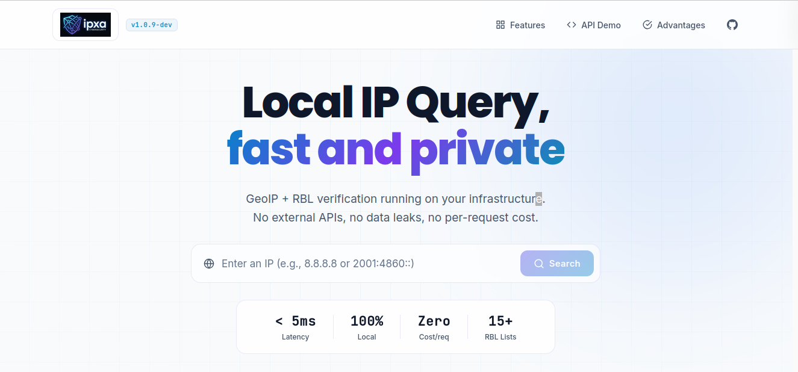
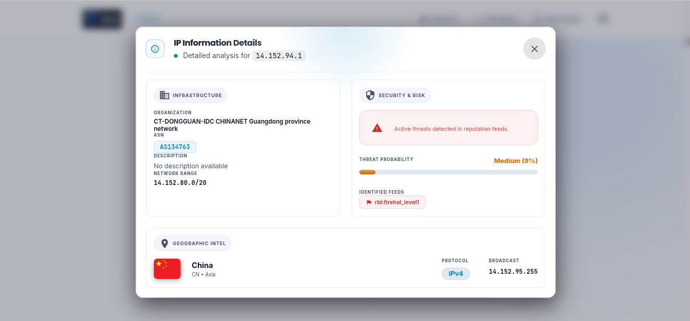
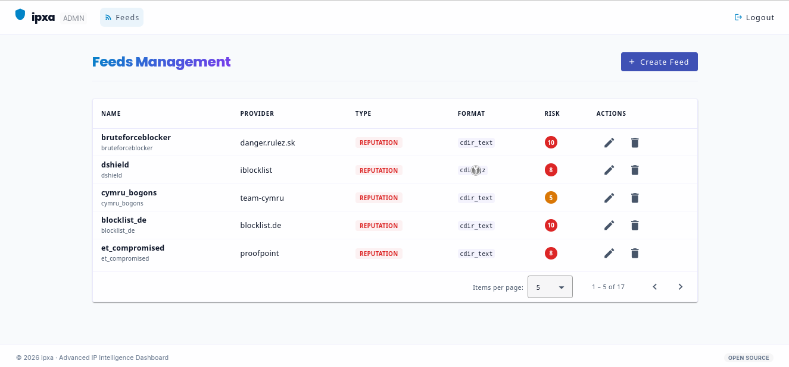

# 🛡️ IPXA
> **IP Reputation and Network Intelligence Monitoring**

**IPXA** is a high-performance, private-by-design platform for threat intelligence aggregation. It provides instant IP reputation queries, GeoIP data, and integration with 15+ Real-time Blackhole Lists (RBLs), all running entirely on your own infrastructure.

[](https://hub.docker.com/r/liberatti/ipxa)
[](LICENSE)
[](https://github.com/sponsors/liberatti)


*Instantly visualize the origin and risk score of any IP address with our premium web dashboard.*


*Multi-workspace environment for isolated security configurations.*

---

## ⚡ Performance & Privacy

- 🚀 **Ultra-low Latency**: Sub-5ms response times.
- 🔒 **100% Private**: Runs entirely on your infrastructure.
- 💰 **Zero Cost**: No per-request fees or subscription limits.
- 🔌 **Air-gap Ready**: Optimized for restricted and high-security environments.

---


## 🌐 User Portal
The **User Portal** (accessible by default on port `5000`) is the main search interface where users can query IP addresses locally to verify geolocation, ASN, and reputation details.


*Instantly query and visualize the geographical origin and threat score of any IP address.*

---

## 🎨 Admin Interface
The **Admin Interface** (accessible on port `5001` at the `/admin` context) features a secure dashboard for managing workspaces, RBL threat lists, and monitoring parameters. It includes a secure session management login system and a one-click logout.

You can configure the access credentials using the following environment variables:

- **ADMIN_EMAIL**: Administrator email (Default: `admin@local`)
- **ADMIN_PASSWORD**: Administrator password (Default: `admin`)


*Manage your workspaces, feeds, and configurations dynamically through a premium, dark-mode administrative dashboard.*

---


## 🚀 Key Features

*   🌍 **Intelligent GeoIP**: Local integration with MaxMind and ip2asn for lightning-fast lookups.
*   🚫 **RBL Orchestration**: Dynamic management of 15+ threat feed sources (Reputation & Bypass).
*   ⚡ **Multiple API Flavors**: Specialized endpoints for exhaustive data, security checks, or high-speed header-based responses.
*   🏢 **Multi-Workspace**: Isolate configurations and API keys across different environments or clients.
*   🎨 **Admin Dashboard**: High-contrast, dark-mode interface for real-time monitoring and data management.

---

## 🛠️ Quick Deploy

IPXA is distributed as a lightweight Docker image.

### Docker Compose

```yaml
volumes:
  data:

services:
  ipxa:
    image: liberatti/ipxa:latest
    environment:
      - API_KEY=dev
      #      - SECURITY_ENABLED=false
      #      - IPINFO_TOKEN=
      #      - IBLOCKLIST_USERNAME=
      #      - IBLOCKLIST_PASSWORD=
      #      - MAXMIND_ACCOUNT_ID=
      #      - MAXMIND_LICENSE_KEY=
    volumes:
      - data:/data
    ports:
      - "5001:5000"
    deploy:
      resources:
        limits:
          memory: 256M
  portal:
    image: liberatti/ipxa-portal:latest
    environment:
      - IPXA_API_KEY=dev
      - IPXA_API_URL=http://ipxa:5000
    ports:
      - "5000:5000"
    deploy:
      resources:
        limits:
          memory: 64M
```
---

## 🔗 Server Integrations (Hooks)

IPXA provides native, high-performance middleware hooks for popular web servers, allowing you to block malicious traffic at the edge. These hooks support **standardized JSON error responses** with unique `request_id` tracking for enhanced observability.

### Apache (`mod_lua`)

Integrate IPXA directly into your Apache configuration using `mod_lua` to evaluate IPs on the fly.

**Quick Setup:**
1. Install `mod_lua` and `lua-socket` (e.g., `yum install httpd mod_lua lua-socket`).
2. Copy `hooks/httpd/lua/*.lua` to your Apache lua directory (e.g., `/etc/httpd/lua/`).
3. Update `/etc/httpd/lua/config.lua` with your IPXA API URL and settings.
4. Hook into your `VirtualHost`:
   ```apacheconf
   <VirtualHost *:80>
       ServerName example.com
       DocumentRoot /var/www/html
       
       # IPXA Access Control
       LuaHookAccessChecker /etc/httpd/lua/ipxa.lua ip_info_check
       
       # IPXA JSON Error Handler
       Alias /errors /etc/httpd/lua/errors.lua
       <Location /errors>
           SetHandler lua-script
       </Location>
       ErrorDocument 403 /errors
   </VirtualHost>
   ```

*(See `hooks/httpd/README.md` for full details).*

### OpenResty / Nginx

Leverage the power of Lua in Nginx via OpenResty for ultra-low latency IP checking, complete with local caching.

**Quick Setup:**
1. Install the `lua-resty-http` package (via `luarocks`).
2. Copy the contents of `hooks/openresty/lua/` to your OpenResty `lualib` path (e.g., `/usr/local/openresty/lualib/ipxa/`).
3. Update `config.lua` with your IPXA API URL and blocklist settings.
4. Configure your `nginx.conf`:
   ```nginx
   http {
       # ...
       lua_package_path "/usr/local/openresty/lualib/ipxa/?.lua;;";
       lua_shared_dict ip_cache 10m; # Required for caching

       server {
           # ...
           error_page 403 /lua-error;

           location / {
               access_by_lua_file /usr/local/openresty/lualib/ipxa/ip_info_check.lua;
           }

           location = /lua-error {
               internal;
               content_by_lua_file /usr/local/openresty/lualib/ipxa/errors.lua;
           }
       }
   }
   ```

*(Check `hooks/openresty/nginx.conf` and `hooks/openresty/Dockerfile` for working examples).*

### 🛡️ Response Format

When a request is blocked, the hooks return a machine-readable JSON response instead of default HTML error pages. This ensures consistent error handling for both browsers and API clients.

**Example Blocked Response:**
```json
{
  "error": "Forbidden",
  "status": 403,
  "request_id": "b10ed3a6f76ad62a75a956ce3e922336",
  "message": "ipxa [block/risk-score]: 172.20.0.1 risk_score=14"
}
```

---

## 📡 API Reference

### 1. Full IP Info
`GET /api/ip/info/{address}`
Returns comprehensive GeoIP, ASN, and reputation data.

**Example Response:**
```json
{
  "ip": {
    "address": "14.152.94.1",
    "broadcast": "14.152.95.255",
    "network": "14.152.80.0",
    "prefix": 20,
    "version": 4
  },
  "location": {
    "continent": "Asia",
    "country_code": "CN",
    "country_name": "China"
  },
  "organization": {
    "asn_description": "",
    "asn_name": "CT-DONGGUAN-IDC CHINANET Guangdong province network",
    "asn_number": 134763
  },
  "security": {
    "reasons": [
      "rbl:firehol_level1"
    ],
    "risk_score": 0
  }
}
```

### 2. Security Check
`GET /api/ip/check/{address}`
Simplified response focused on reputation and risk assessment.

**Example Response:**
```json
{
  "ip": "14.152.94.1",
  "risk_score": 0,
  "reasons": ["rbl:firehol_level1"]
}
```

### 3. Quick Decision (Headless)
`GET /api/ip/quick/{address}`
Optimized for firewalls and middleware. Returns risk score in body and `x-risk-score` header.

**Example Response:**
```json
{
  "risk_score": 9
}
```

---

## 🛠️ Testing & Development

IPXA includes an `api.rest` file for rapid API testing.

1.  **VS Code**: Install the [REST Client](https://marketplace.visualstudio.com/items?itemName=humao.rest-client) extension.
2.  **Run**: Open `api.rest` and click `Send Request` above any endpoint.
3.  **Explore**: Use these examples as a baseline for your own integrations.

---

## 🔌 RBL Feed Management

While advanced users can still add JSON files in `config/`, IPXA now features a complete **Admin Panel** to manage feeds dynamically through the UI.

| Field | Description |
| :--- | :--- |
| `name` | Human-friendly identifier for the feed |
| `slug` | Unique internal identifier |
| `type` | `reputation` (for blocking) or `bypass` (for allowlisting) |
| `source` | Public URL for download (CIDR or IP list) |
| `format` | `cdir_text` (plain text) or `cdir_gz` (compressed) |
| `risk_score` | Weight of this feed in the final decision (0-10) |

---

## 📦 Integrated Feeds

Includes a pre-configured library of industry-standard feeds:

- **FireHOL Level 1-4**: Highly curated aggregation.
- **Cisco Talos & DShield**: Global threat intelligence.
- **Abuse.ch Feodo**: Botnet C2 tracking.
- **Spamhaus DROP**: SBL Advisory blocks.
- **Emerging Threats**: Known compromised hosts.
- **Blocklist.de & GreenSnow**: SSH/Mail brute force.

---

## ⚖️ Limitation of Liability

**Disclaimer of Warranty**: This software is provided "AS IS", without warranty of any kind, express or implied. The author(s) and contributor(s) shall not be liable for any claim, damages, or other liability, whether in an action of contract, tort, or otherwise, arising from, out of, or in connection with the software or the use or other dealings in the software.

**Use at Your Own Risk**: You are solely responsible for any decisions made or actions taken based on the data provided by IPXA. The software involves security-related functions; its misconfiguration or misuse could lead to service disruption or security gaps.

---

## 📄 License

This project is licensed under the Apache License 2.0. See the [LICENSE](LICENSE) file for details.
